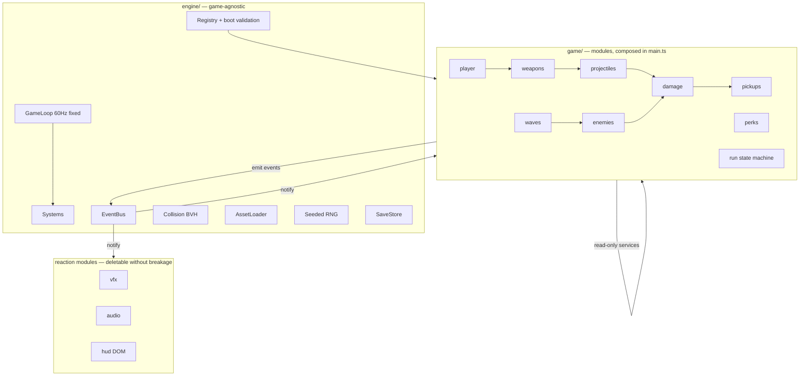

# ARCHITECTURE.md

Living document. Update it in the same PR as any change that alters structure, dependencies, or rules stated here.

## 1. Project Structure

```
├── index.html                  # mounts #app (canvas) + #hud root
├── public/assets/
│   ├── models/                 # .glb, filename = content id (pistol.glb)
│   └── audio/                  # only if CC0 music tracks are adopted
├── tools/
│   └── build-assets/
│       ├── recipes/            # procedural mesh recipes, one per model (glob)
│       ├── import/             # CC0 pack normalization configs
│       ├── style.ts            # palette tokens, material factories, tri budgets
│       └── build.ts            # recipes + imports → optimized GLBs
└── src/
    ├── main.ts                 # composition root; the only file that knows all modules
    ├── engine/                 # game-agnostic layer; compiles without game/
    │   ├── GameLoop.ts         # fixed timestep (60 Hz), render interpolation
    │   ├── EventBus.ts         # typed pub/sub
    │   ├── Registry.ts         # generic def store + boot validation
    │   ├── AssetLoader.ts      # id → GLB / animation clips
    │   ├── Collision.ts        # BVH static world + dynamic capsule/sphere queries
    │   ├── Input.ts            # raw input → named actions (rebindable)
    │   ├── Rng.ts              # seeded PRNG; raw Math.random is lint-banned in game/
    │   ├── Pool.ts             # generic object pool
    │   ├── SaveStore.ts        # versioned localStorage persistence
    │   └── types.ts            # System, GameModule, EngineContext
    └── game/                   # gameplay layer: one folder = one module
        ├── events.ts           # core event map; modules extend via declaration merging
        ├── stats.ts            # stat pipeline: base → flat adds → multipliers
        ├── run/                # roguelite spine: state machine + meta-progression
        ├── world/              # arena geometry, lighting, collider registration
        ├── player/             # movement, camera, dash, input mapping
        ├── weapons/            # WeaponSystem + defs/ (pistol.ts, shotgun.ts, …)
        ├── projectiles/        # pooled projectiles, hitscan + travel
        ├── enemies/            # EnemySystem + behaviors/ (chase.ts, …) + defs/
        ├── damage/             # the only place HP changes
        ├── waves/              # WaveSystem + defs/ (composition curves, bosses)
        ├── pickups/            # scrap/XP/health drops
        ├── perks/              # PerkSystem + defs/ (stat modifiers as data)
        ├── vfx/                # muzzle flash, tracers, hit sparks, damage numbers
        ├── audio/              # listener-only; sound defs are ZzFX params
        └── hud/                # listener-only DOM overlay
```

## 2. High-Level System Diagram



Data flow: input → gameplay systems (ordered update) → events → reaction modules.
State queries go through read-only services; state changes go through events.

## 3. Core Components

Single-page client-only game. No backend, no server runtime.

### 3.1 Engine (`src/engine/`)

Game-agnostic. Public surface is `EngineContext`; game code never imports engine internals.

```ts
interface GameModule { id: string; register(ctx: EngineContext): void }

interface EngineContext {
  scene: THREE.Scene
  camera: THREE.PerspectiveCamera
  bus: EventBus
  registry: Registry          // def store: registry.get('weapon', 'pistol')
  assets: AssetLoader
  collision: Collision
  input: Input
  rng: Rng
  services: Services          // cross-module read-only queries
  addSystem(sys: System, order: number): void
}
```

### 3.2 Game modules (`src/game/`)

`main.ts` composes: `engine.use(worldModule, playerModule, …, hudModule)`.
Update order is the explicit `order` number; convention: input/player 0–19, gameplay 20–59, reactions (vfx/audio/hud) 60+.

Communication rules:

- **Events** are the only trigger mechanism. Immediate synchronous dispatch; entity spawn/despawn deferred to end of frame. Core events in `game/events.ts`; each module declares its own events via TS declaration merging (zero shared-file edits). Naming: `domain:pastTenseVerb` (`weapon:fired`, `enemy:died`).
- **Services** are the only read mechanism: `ctx.services.enemies.aliveCount()`. Depend on the interface, never the system class.
- Importing another module's internals is forbidden (lint-enforced).
- Litmus test: deleting `vfx/`, `audio/`, or `hud/` must not break compilation of anything else.

### 3.3 Content defs (data-driven core)

One file exports one def through a typed helper:

```ts
// game/weapons/defs/shotgun.ts
export default defineWeapon({
  id: 'shotgun',
  model: 'shotgun',          // → public/assets/models/shotgun.glb
  sound: 'shotgun_fire',     // → audio def id
  damage: 8, pellets: 6, spread: 0.09, rof: 1.4, mag: 6, reload: 1.6,
})
```

- `defs/` folders auto-discovered via `import.meta.glob`; dropping a file adds content.
- All cross-references are string ids. `Registry.validateAll()` at boot: every id must resolve, every def must pass schema. Failure names file and field. No silent fallbacks.
- Stats: `final = (base + Σ flat) × Π multipliers`; perks are data (`{ stat: 'rof', mul: 1.15 }`).
- Gameplay flow: `run/` owns `menu → run → upgradeChoice → … → death → metaShop → menu`.

### 3.4 Rendering & performance budget

- Target: 60 fps with 100+ enemies. Enemies via `InstancedMesh` per type; skinned models share retargeted `AnimationMixer` clips.
- Projectiles, vfx, pickups pooled (`engine/Pool.ts`); no allocation in the hot loop.
- Level geometry merged + BVH-indexed at arena load.
- Post chain: bloom + vignette (+ pickup outline).

### 3.5 Asset pipeline (`tools/build-assets/`)

1. CC0 packs (outside repo) normalized via per-pack configs in `import/` (scale, rotation, clip renames).
2. Procedural props/arena from `recipes/`.
3. `npm run assets`: glTF-Transform prune/weld/quantize + meshopt → `public/assets/models/<id>.glb`.
4. Runtime never fixes up assets; a load-time scale hack means the pipeline is broken.
5. Visual consistency is enforced by `style.ts`: recipes take colors/materials/budgets only from its tokens, and `build.ts` fails on out-of-palette colors or blown tri budgets.
6. SFX = ZzFX param arrays in `audio/defs/` (authored at sfxr.me). Music = ZzFXM patterns.

## 4. Data Stores

| Store | Tech | Contents |
|-|-|-|
| Save data | `localStorage` via `SaveStore` | Meta-progression, unlocks, settings, best runs. Versioned schema + migration on load |
| Runtime registries | In-memory `Registry` | All content defs, validated at boot |
| No server-side storage | — | By design; see Future Considerations |

## 5. External Integrations

Runtime: **none.** No CDN, no analytics, no network calls; the built site is fully self-contained.

Dev/asset-time only:

| Source | Use | License |
|-|-|-|
| Quaternius (Zombie Apocalypse Kit, Universal Animation Library) | Rigged/animated enemies, shared clips | CC0 |
| KayKit Skeletons | Second enemy family | CC0 |
| Kenney (Blaster Kit, UI Pack, Fonts) | Weapons, HUD art, font | CC0 |
| Poly Pizza | Additional guns/props | verify CC0 per model |
| sfxr.me | SFX param authoring | tool only |
| OpenGameArt / Kenney music | Fallback CC0 tracks | verify CC0 per track |

## 6. Deployment & Infrastructure

- Build: `vite build` → static files. Host: any static host (GitHub Pages or itch.io; decide at first release).
- CI (when repo goes remote): typecheck + lint + vitest + asset build as merge gate.
- No servers, no infra secrets, no monitoring — client-only.

## 7. Security Considerations

- No auth, no PII, no network I/O; attack surface is the supply chain and the save file.
- Runtime deps pinned (4 npm: `three`, `three-mesh-bvh`, `postprocessing`, `zzfx`); lockfile committed; licenses MIT/Zlib only. `zzfxm` is not published on npm: its MIT source (keithclark/ZzFXM) gets vendored at a pinned commit when the audio module lands, and still counts against the approved-dep list.
- `SaveStore` treats `localStorage` as untrusted input: schema-validated on load, corrupt saves quarantined, never `eval`'d.
- Asset licensing is a compliance concern: everything shipped must be CC0-verified (tracked in `tools/build-assets/import/`).

## 8. Development & Testing Environment

- Requirements: Node ≥ 20, npm. Setup: `npm i && npm run assets && npm run dev`.
- Scripts: `dev`, `build`, `assets` (GLB pipeline), `test` (vitest), `lint`, `typecheck`.
- Tests (vitest, pure logic): stats pipeline, perk stacking, wave curves, save migration, registry validation.
- Enforcement (eslint-plugin-boundaries + rules): module isolation, engine→game import direction, `Math.random` ban in `game/`.
- Dev-only tools: tweakpane (live balance sliders), stats-gl (GPU frame time). Stripped from production build.
- Determinism: fixed timestep + seeded RNG → a run is reproducible from its seed (debugging and balance work depend on this).

### How to add things

| Goal | Steps | Shared files touched |
|-|-|-|
| Weapon | `weapons/defs/x.ts` + model id (pack import or recipe) | 0 |
| Enemy | `enemies/defs/x.ts`, reuse a behavior id | 0 |
| AI behavior | `enemies/behaviors/x.ts` | 0 |
| Perk | `perks/defs/x.ts` with stat modifiers | 0 |
| Sound | `audio/defs/x.ts` (ZzFX params) | 0 |
| Wave/boss | `waves/defs/x.ts` | 0 |
| Stat | key in `stats.ts` + consuming system | 1–2 |
| Mechanic/system | new module folder | 1 line in `main.ts` |
| Swap a system | replace module in `main.ts` | 1 line |

## 9. Future Considerations

- **Out of scope now, revisit deliberately:** multiplayer (invalidates event/timestep assumptions — full architecture pass required), mobile/touch controls, physics engine, ECS framework.
- **Pre-approved when evidence demands:** `@three.ez/instanced-mesh` (if instancing profiling says so), `vite-plugin-glsl` (first custom shader), CC0 music tracks vs ZzFXM (after listening test).
- **Known debt from day one:** none yet; record here when accepted.

## 10. Project Identification

- **Name:** Project-X — low-poly 3D FPS roguelite.
- **Repository:** https://github.com/vuxnd/project-x
- **Owner:** vund.personal@gmail.com.
- **Last updated:** 2026-08-13.

## 11. Glossary

| Term | Meaning |
|-|-|
| Module | Self-contained gameplay folder with a `register(ctx)` entry point |
| System | Per-frame update unit owned by a module, ordered by priority |
| Def | One content data file (weapon, enemy, perk, …), id-referenced |
| Service | Read-only query facade a module exposes to others |
| Run | One roguelite attempt, menu-to-death |
| Meta-progression | Permanent upgrades persisting across runs |
| Perk | In-run stat modifier chosen on wave clear |
| BVH | Bounding volume hierarchy — spatial tree for fast ray/shape queries |
| Pooling | Reusing preallocated objects to avoid GC hitches |
| ZzFX / ZzFXM | Parameter-based SFX synth / tracker music format |
| CC0 | Public-domain-equivalent license, no attribution required |
